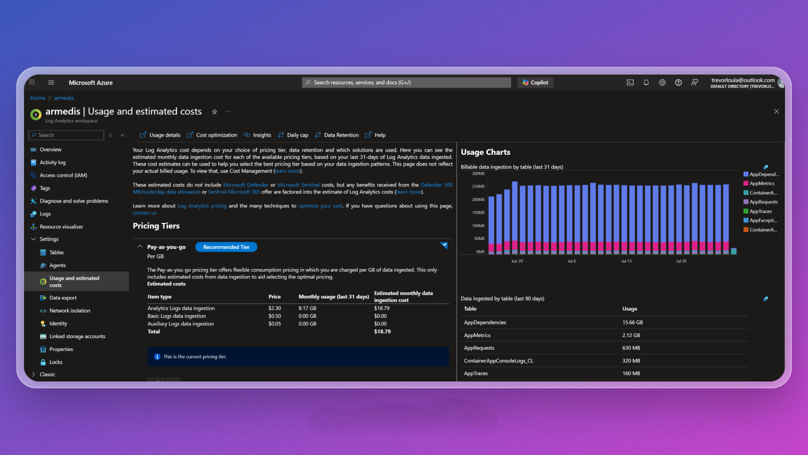
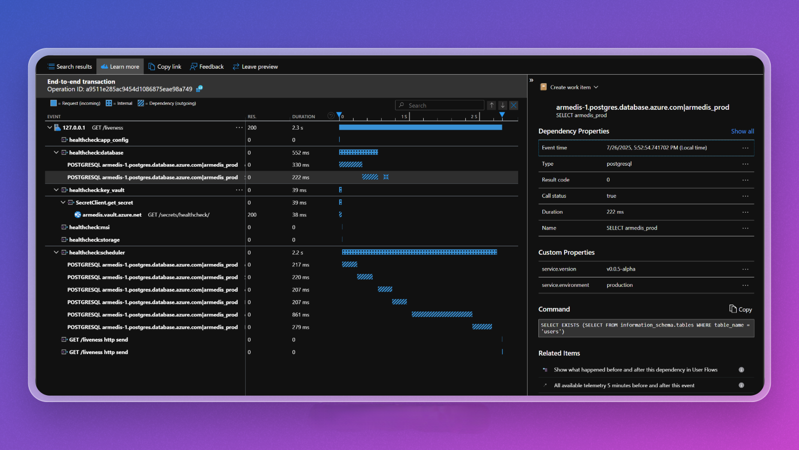
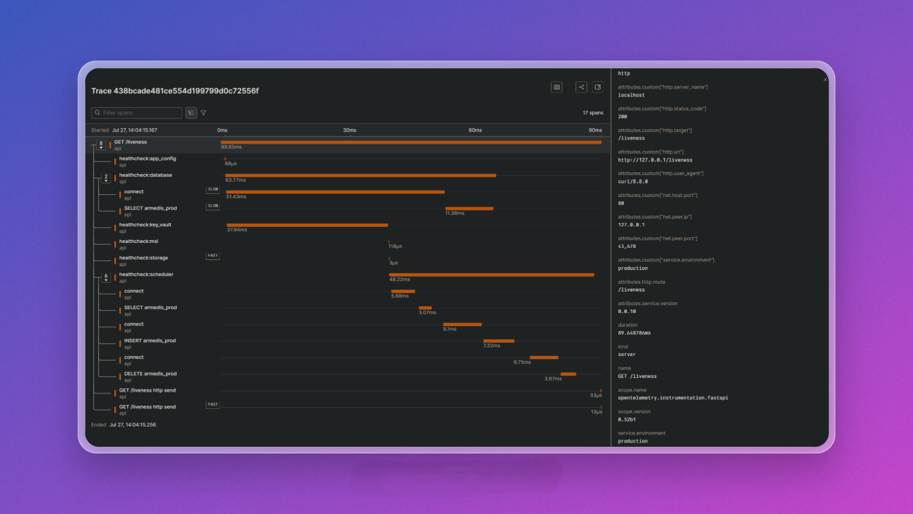

I built my apps on Azure, so naturally I went with Azure Monitor / Log Analytics / Application Insights as my observability platform.

Axiom and BetterStack have both been on my radar for a while now, but I hadn't had a compelling reason to switch - until now.

## The Pricing Problem

My telemetry volume from [CheckIn More](../../projects/checkin-more) has been growing. In part because I had stability concerns around the task scheduler, so I added a robust healthcheck step that emits a lot of spans.

Azure Application Insights provides the trace and metric explorer interfaces, but the underlying data is stored in Azure Log Analytics. Log Analytics charges a whopping $2.30 / GB for ingestion. I was ingesting ~10 GB / month, so that's $23 / month just for telemetry - that's more than my container and database.

I also haven't been thrilled with the UI of Application Insights and have been wanting to try out some alternatives. So I decided to switch to Axiom because they have a free tier unlike BetterStack.

## The Switch

Switching to Axiom was pretty easy - especially with the help of Claude - just had to make a few changes to my log, trace, and metric exporters to point to Axiom's ingestion endpoints. Took under an hour from start to finish.

## Initial Thoughts

At first, I felt a little lost. Application Insights has a lot of pre-built dashboards full of cool widgets and insights. Axiom is much more barebones and relies on you to create your own widgets from the raw data using their query language.

But after playing around in it for a while, I'm really starting to appreciate the power and flexibility of Axiom. It essentially seamlessly combines logs, traces, and metrics into a single queryable dataset. Their query language is very similar to KQL, so I was immediately comfortable with it.

With Azure Monitor, you need to use Application Insights for traces, Log Analytics for logs, and custom metrics dashboards for metrics. You can manually combine them into Azure Monitor Workbooks, but it's not as seamless as Axiom's approach.

Application Insights has tools for easily filtering traces by trace type (i.e. Request, Dependency, etc.) and by trace attributes (Service Name (api), Service Environment (prod, stage), Service Version (1.0.0), etc.). Axiom doesn't have a pre-built way to do this, but you can add widgets to your dashboard to filter by anything. So it's harder to setup, but feels more powerful for massive datasets.

### UI Comparison

The Application Insights trace explorer UI feels a bit dated. The problem in general with the major cloud providers is that they whip together something that works and people (like me - or more importantly, enterprises with the big bucks) will use it because they're already using other services. Even though the individual services themselves aren't anything special.

Then smaller companies like Axiom come along and do one thing and do it well.

The Axiom UI feels much more modern. And I'm all about Making Telemetry Great Again.

## Conclusion

For now I'm happy to not be spending $20/month on telemetry, and I'm looking forward to playing around more with Axiom.
