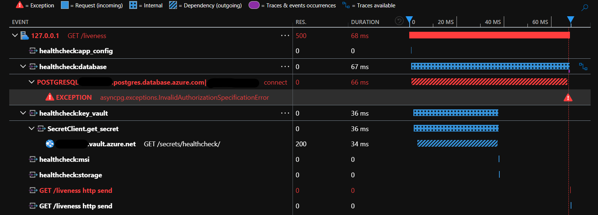

import { Code } from 'astro-expressive-code/components';
import CodeDropdown from '../../components/CodeDropdown.astro';
import healthcheckCode from '../assets/code/healthcheck.py?raw';
import healthcheckResponse from '../assets/code/healthcheck-response.json?raw';

Does your backend service have a healthcheck? Don't know what a healthcheck is? Unsure how to create a robust healthcheck?

Continue reading for the fundamentals of healthchecks - from why they are necessary to how to implement them.

## What is a healthcheck?

A healthcheck is a function that checks the core vitals of a backend application. For example, it would check to ensure your app can access its database, configuration store, secret manager, etc.

## Why are healthchecks necessary?

You have a production application with real users depending on your service. How are you alerted if something goes awry? Do you wait for your users to inform you? Hope you happen to notice it yourself? The most fundamental alert you should have is a healthcheck. If a core component of your app is in a bad state - your healthcheck should fail.

## Failed healthcheck mitigations

Okay - so something critical breaks, say your app hit some obscure bug in one of its dependent packages and completely locks up (happened to me). What happens? Your healthcheck should fail, and you have two main options:

1. Configure your hosting platform to restart your app. This is a very common practice and can auto-mitigate many issues like the one I ran into.
2. Setup alerts. Most hosting platforms should have a service to alert you via email, push notification, phone call, etc if your healthcheck fails. If your hosting service does not provide this, there are many monitoring services that do this.

## Implementation options

There are two main methods of running healthchecks:

1. The most common is to have your hosting platform regularly send an API request to your app. (i.e. GET `/healthcheck` every 15 seconds). If the app is dead or the endpoint returns a 5XX, the healthcheck fails.
2. Alternatively, you can use an observability tool like OpenTelemetry to regularly call your healthcheck method from within your app and emit a metric on success. This method is a little more complicated because it requires setting up a monitor to monitor your healthcheck metric and alert on the absence of a metric - if your app dies and stops emitting a healthcheck metric, the monitor will trigger an alert.

## Function implementation

Here are some opinions I've formed on implementing healthchecks:

1. The endpoint should be protected. This is important to:
    - Protect against DOS attacks by dropping unauthenticated connections ASAP.
    - Protect against leaking potentially important information about your service - especially if you return exceptions.
2. The function should be cheap and fast.
3. The function should perform all checks asynchronously.
4. The function should check all dependencies and any internal services if possible.
5. The function should include proper tracing to help with debugging.
6. The response body should include a list of all the checks. For each check, include a bool for pass / fail and the exception if one occurred.

### Tracing

Proper tracing makes debugging failed healthchecks much easier. This trace shows exactly why this healthcheck failed: the database token expired.

It also visualizes the async implementation - all the checks run in parallel rather than waiting for one to finish before starting the next one.

### Example

Here's an example API response from my [MCP Fabric](../../projects/mcp-fabric) control plane healthcheck:

<Code code={healthcheckResponse} lang="json" title="API Response" />

If you want a full code example, here is MCP Fabric's healthcheck module:

<CodeDropdown 
  title="View Full Healthcheck Implementation"
  filename="healthcheck.py"
  code={healthcheckCode}
  language="python"
/>

## Conclusion

Healthchecks are a fundamental part of any production application. They are a simple way to ensure your application is running as expected and alert you if something goes wrong.
