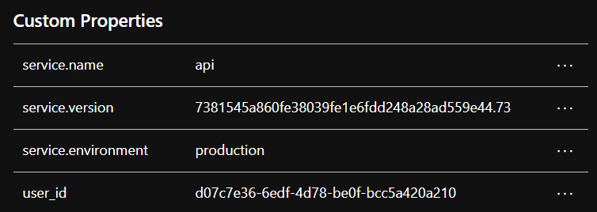
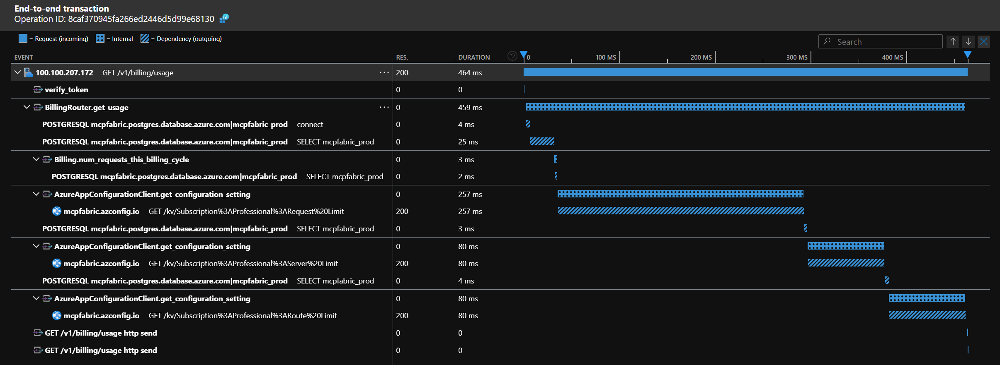

import { Code } from 'astro-expressive-code/components';
import TelemetryFastAPIExample from '../assets/code/telemetry.py?raw';

Telemetry - which enables monitoring and observability - is absolutely critical for production systems. Without it, you're flying blind.

Follow along for an introduction to modern telemetry - from the basics to real-world examples.

> This post is written for engineers who are new to telemetry like I was a couple years ago. If you're already familiar with modern telemetry and looking for a deeper dive, this post may not be for you.

### Mini Rant

I work on enterprise cloud - yet I'm continually surprised by how little most engineers know about telemetry. It's often added as an afterthought to systems - if at all. The most common form of telemetry I see is unstructured logs; these are like a black-and-white TV compared to traces.

Do yourself a favor - take a little time now to learn about modern telemetry and bake it into your projects from the start. Once you do, you'll never look back.

### Definitions

Upon graduating college, I had never heard of telemetry, monitoring, or observability. When I started my current role on an enterprise cloud platform team, they quickly became a part of my daily vocabulary.

Here's a quick overview of what they all refer to:

**Telemetry** is data emitted by applications for the purposes of monitoring and observability. This includes logs, traces, and metrics.

**Observability** refers to how well you can understand the internal state of a system based on its outputs (telemetry). Telemetry enables observability, which enables issue investigation.

**Monitoring** is using telemetry to monitor the health and performance of a system. Think dashboards and alerts.

## Logs

Logs are by far the most common form of telemetry. They are generally unstructured and include a timestamp, level (info, warning, error), and a message.

Logs are useful for monitoring system-level events (i.e. startup, shutdown, etc.), but unstructured logs quickly become a burden when used for application-level events (i.e. API requests, database queries, etc.).

## Traces

Traces track the flow of a request through a system. In a simple sense, when a request comes in, it is assigned a unique identifier. The identifier is passed with the request throughout the system and used to correlate emitted events together.

### Spans

Spans are used to further break down a trace into smaller units of work. You can both manually wrap your code in spans and use auto-instrumentation libraries for common frameworks (e.g., FastAPI, HTTPX, SQLAlchemy, etc.) to generate spans.

Each span represents a discrete operation (e.g., a DB query or an external API call) and includes timing information.

Spans can have attributes associated with them. For example, rather than logging a user ID, you can add it as an attribute to a span.

Here's an example span with custom attributes:

    

### Events

Events are timestamped annotations added to spans - like inline logs tied to a specific point in a trace. For example, if you emit a critical error without any context, you'd struggle to determine where the error occurred. With events, the error is attached to the span, providing context for the error.

### Trace Visualization

Okay - that's a lot of words. This makes way more sense with an example.

This is the trace for an API request to one of my project's ([MCP Fabric](../projects/mcp-fabric)) billing endpoints visualized in [Azure Application Insights](https://learn.microsoft.com/en-us/azure/azure-monitor/app/app-insights-overview). This is a night-and-day difference compared to logs. You can immediately see the entire request flow, including the database queries to get current usage and the HTTP request to the app configuration store to get limits for the user's plan. Also note that this clearly shows that the request would be much faster if I were to fetch the data asynchronously - gotta fix that.

## Metrics

Metrics are numeric measurements representing the state or behavior of a system at a point in time or over time. They are much lighter and faster than logs or traces. Common use-cases for metrics include: system resource counters (CPU, memory, disk), active connections, and request counts.

Here are some of the key metric instruments supported by OpenTelemetry:

- **Counter**: A value that accumulates over time - you can think of this like an odometer on a car; it only ever goes up.
- **Gauge**: Measures a current value at the time it is read. An example would be the fuel gauge in a vehicle. Gauges are synchronous.
- **Histogram**: A client-side aggregation of values, such as request latencies.

### Dimensions

Most telemetry systems allow you to add dimensions to metrics. Dimensions are key-value pairs that can be used to aggregate metrics. For example, you can add a dimension to a metric to track the number of requests by status code.

## OpenTelemetry

Prior to OpenTelemetry, telemetry was a bit of a wild west. OpenTelemetry unified earlier efforts like OpenCensus and OpenTracing, giving us a single standard for logs, metrics, and traces.

OpenTelemetry is relatively new, but is quickly becoming the industry standard for telemetry. It's supported by all the major cloud providers and has a large community.

Checkout their website at [opentelemetry.io](https://opentelemetry.io/) for more information.

### Python FastAPI Example

If you've read some of my other posts, you'll know that I'm a fan of FastAPI. So naturally, I'll continue the trend here.

This is a very simplified example of how to initialize OpenTelemetry in a FastAPI application.

The auto-instrumentation is super powerful. This automatically generates traces for incoming API requests, database queries (showing the general query being executed), and outgoing HTTP requests.

<Code code={TelemetryFastAPIExample} lang="python" title="telemetry.py" />

## Monitoring & Observability Platforms

OpenTelemetry handles the collection and export of telemetry, but you'll still need a platform to store and visualize the data.

All the major cloud providers have their own monitoring and observability platforms which are normally a natural choice if you're already using their services.

There are also many standalone platforms that support OpenTelemetry. In my experience, they may be more expensive than the cloud providers, but they are easier to use and offer more features.

Here are the few that I've either used or heard good things about to give you a starting point:

- [Azure Application Insights](https://learn.microsoft.com/en-us/azure/azure-monitor/app/app-insights-overview)
- [Axiom](https://axiom.co/)
- [BetterStack](https://betterstack.com/)
- [Datadog](https://www.datadoghq.com/)

Vendors like Datadog, Axiom, etc., often offer richer UI and cross-service correlation features that can be valuable in polyglot stacks.

I recently switched from Azure Application Insights to Axiom - [blog here](../axiom-move).

## Conclusion

Robust telemetry enabling insightful monitoring and observability is critical for production systems. Invest the time now to integrate telemetry into your projects and your future self will thank you. Start by auto-instrumenting a test app or one small part of your service and you'll be amazed at what you uncover.
