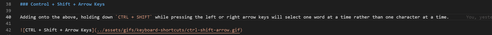
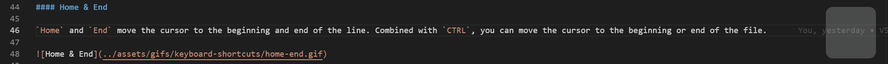

VS Code keyboard shortcuts are absolutely goated 🐐. If you regularly write code or even just manipulate text files, you should be using them.

When I started my first developer job out of college, I printed out the PDF of all keyboard shortcuts and kept it on my desk. I then challenged myself to memorize and master a new shortcut every couple days. You can find it in VS Code with the shortcut `CTRL + K, CTRL + R` (which links to [this PDF](https://code.visualstudio.com/shortcuts/keyboard-shortcuts-windows.pdf)).

Mastering keyboard shortcuts will transform your relationship with your IDE - going from a toddler awkwardly blundering around to a ninja gracefully manipulating files.

Yes, even if when AI does most of the tedious work for us nowdays, keyboard shortcuts are still useful for tasks from quick edits to mass changes.

## Illustration

Alas, a video is worth a thousand words and I like to keep things short and to the point - check difference:

### Without Keyboard Shortcuts

### With Keyboard Shortcuts

## Shortcuts Everyone Should Know

Here are some of my favorite shortcuts that I use all the time. If you aren't already familiar with them, I'd recommend trying them out as you read through the rest of the post. These are just the absolute basics - there are countless more to discover.

### Basic Navigation

These tips aren't VSCode specific - they'll make you a keyboard ninja in any application.

#### Control + Arrow Keys

Holding down `CTRL` while pressing the left or right arrow keys will move the cursor one word at a time rather than one character at a time.

#### Control + Shift + Arrow Keys

Adding onto the above, holding down `CTRL + SHIFT` while pressing the left or right arrow keys will select one word at a time rather than one character at a time.

#### Home & End

`Home` and `End` move the cursor to the beginning and end of the line. Combined with `CTRL`, you can move the cursor to the beginning or end of the file.

### Advanced Manipulation

These unfortunately only work in VSCode. I often find myself copypasting text from OneNote/Word/etc into VSCode just to use them to manipulate text.

#### Cut Line

`CTRL + X` without anything selected will cut the entire line. I use this all the time just to delete lines as well.

#### Copy Line

`CTRL + C` without anything selected will copy the entire line.

#### Delete Line

`CTRL + SHIFT + K` will delete the line.

#### Add Selection to Next Find Match

Here's where the magic starts. `CTRL + D` will add the next occurrence of the selected text to the selection.

#### Move Line Up / Down

`ALT + UP` will move the line up. `ALT + DOWN` will move the line down.

#### Copy Line Up / Down

`SHIFT + ALT + UP` will copy the line up. `SHIFT + ALT + DOWN` will copy the line down.

#### Multiselect

Multiselect is a game changer. Here are some of the shortcuts for it:

- Holding down `ALT` while clicking will add a new cursor to the line.

- `CTRL + ALT + UP/DOWN` will add a new cursor above/below the current cursor.

- Clicking with the scroll wheel will add a new cursor to the line.

## Conclusion

Keyboard shortcuts are a powerful tool to speed up your workflow. Take the time to master them and your future self will thank you.
